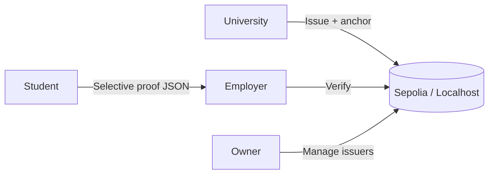

# CredChain

**Decentralized Academic Credential System with Selective Disclosure**

HUST Blockchain Capstone 2025.2 - IT4527E

Universities issue tamper-evident credentials on-chain. Students share only the courses they choose. Employers verify authenticity without seeing the full transcript.

---

## How it works



| Role | What they do |
|------|----------------|
| **Owner** | Deploy contracts, register university wallets |
| **University** | Issue credentials, view/revoke anchored records |
| **Student** | Pick courses to disclose, export a proof file |
| **Employer** | Upload proof, run full validity checks |

Cryptography and Merkle logic live in **`shared/`** and are reused by both the web UI and CLI scripts.

---

## Repository layout

```
contracts/     Solidity (CredentialRegistry, MerkleVerifier) + Hardhat
shared/        Shared TypeScript crypto + Merkle tree + ABIs
frontend/      React web app (primary demo interface)
scripts/       CLI tools + deploy script + integration tests
data/          Sample JSON inputs/outputs (CLI flow)
```

---

## Quick start (demo on Sepolia)

```bash
npm install
npm run deploy:sepolia
cp frontend/.env.example frontend/.env
npm run frontend
```

Set `contracts/.env` (`PRIVATE_KEY`, `SEPOLIA_RPC_URL`) before deploy. Copy contract addresses into `frontend/.env`.

Open http://localhost:5173 - connect MetaMask on **Sepolia** - follow the [Frontend Guide](./frontend/README.md).

---

## Documentation

| Guide | Audience | Contents |
|-------|----------|----------|
| [Frontend README](./frontend/README.md) | Demo, presentation | Setup, MetaMask, UI walkthrough |
| [Scripts README](./scripts/README.md) | Developers, CI | CLI commands, when to use scripts vs UI |
| [Architecture](./docs/architecture.md) | All | General system architecture | 

---

## Common commands

| Command | Description |
|---------|-------------|
| `npm run frontend` | Start Vite dev server |
| `npm run deploy:sepolia` | Deploy contracts to Sepolia |
| `npm run deploy` | Deploy to local Hardhat node |
| `npm run node` | Start local Hardhat chain |
| `npm run test:contracts` | Hardhat Solidity tests |
| `npm run test:e2e` | End-to-end integration test |
| `npm run compile` | Compile contracts |

---

## Tech stack

- **Chain:** Ethereum Sepolia (default) or Hardhat localhost
- **Contracts:** Solidity 0.8.20, OpenZeppelin Ownable
- **Frontend:** React, Vite, wagmi v2, viem
- **Scripts:** TypeScript, ethers v6, ts-node

See [scripts/INSTRUCTIONS.md](./scripts/INSTRUCTIONS.md) for extended CLI reference.